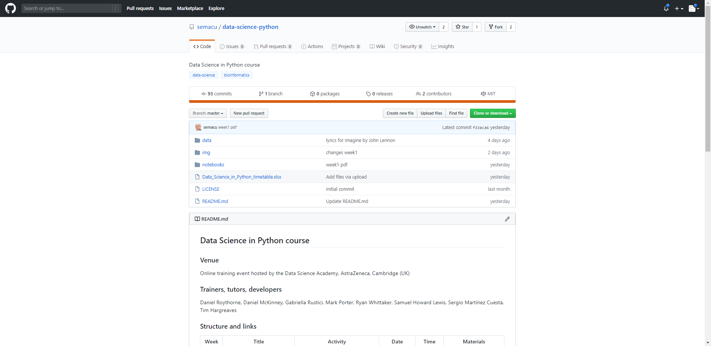
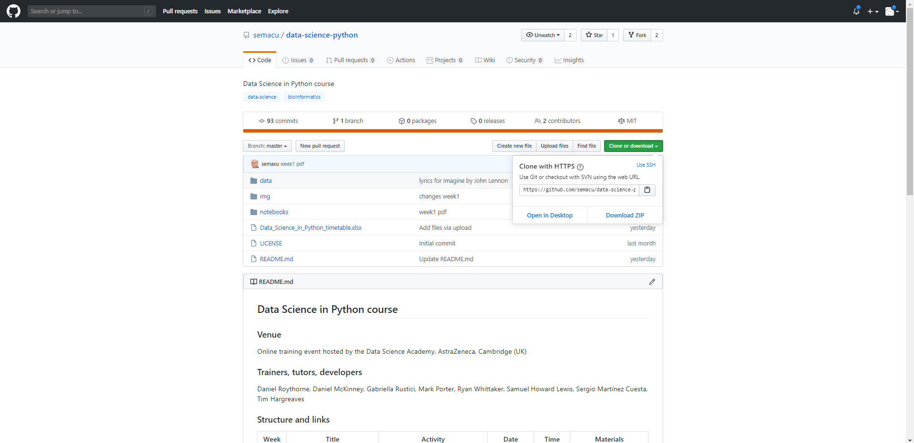
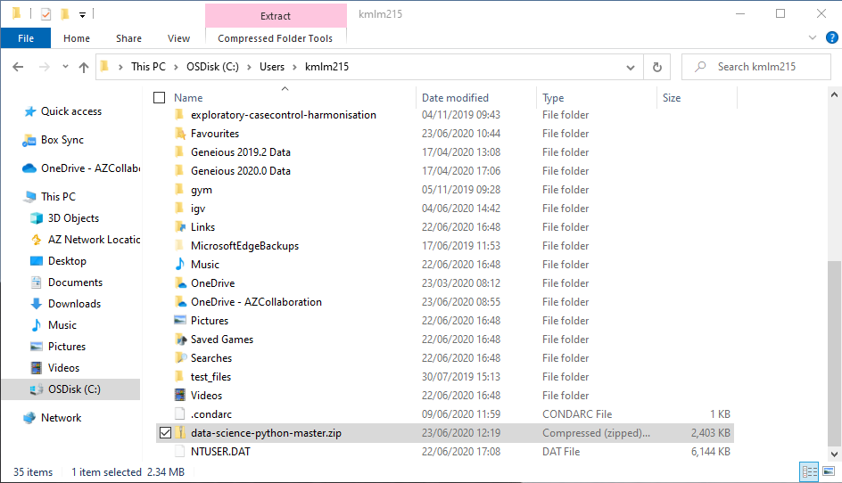
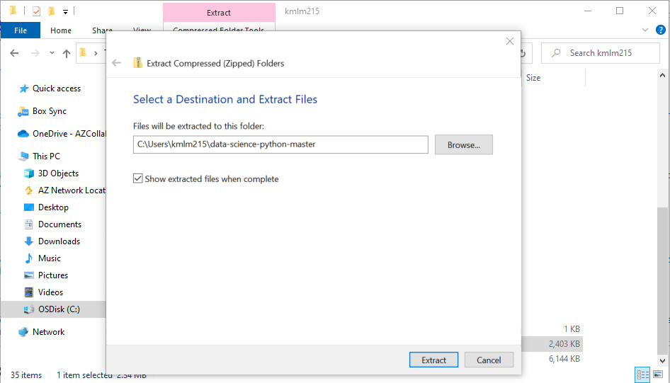
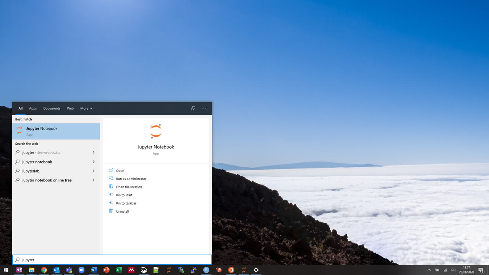

## Data Science in Python course

### Venue

Online training event hosted by the Data Science Academy, AstraZeneca, Cambridge (UK)

### Trainers, tutors, developers

Tim Hargreaves, Samuel Howard Lewis, Sergio Martínez Cuesta, Daniel McKinney, Mark Porter, Daniel Roythorne, Gabriella Rustici, Ryan Whittaker

### Structure and links

Week | Title | Activity | Date | Time | Materials | Lead |
:---:|:-----:|:--------:|:----:|:----:|:---------:|:----:|
0 | Getting ready | preparation | before start | before start | [Introduction and installations](notebooks/week0_materials.ipynb) | -
1 | Recap basic Python concepts | Lecture | 22/06/2020 | 3-4pm BST | [Lecture](notebooks/week1_lecture.ipynb) | SMC
1 | Recap basic Python concepts | Throubleshooting | 22/06/2020 | 4-5pm BST | - | All
1 | Recap basic Python concepts | Practical recap | 26/06/2020 | 3-4pm BST | [Solution](notebooks/week1_solution.ipynb) | SMC
2 | Writing and using functions | Lecture | 29/06/2020 | 3-4pm BST | [Lecture](notebooks/week2_lecture.ipynb) | SHL
2 | Writing and using functions | Practical recap | 03/07/2020 | 3-4pm BST | [Solution](notebooks/week2_solution.ipynb) | SHL
3 | Data handling | Lecture | 06/07/2020 | 3-4pm BST | [Lecture](notebooks/week3_lecture.ipynb) | SMC
3 | Data handling | Practical recap | 10/07/2020 | 3-4pm BST | [Solution](notebooks/week3_solution.ipynb) | SMC
4 | Data visualization | Lecture | 13/07/2020 | 3-4pm BST | [Lecture](notebooks/week4_lecture.ipynb) | SHL
4 | Data visualization | Practical recap | 17/07/2020 | 3-4pm BST | [Solution](notebooks/week4_solution.ipynb) | SHL
5 | Data analysis and modeling | Lecture | 20/07/2020 | 3-4pm BST | [Lecture](notebooks/week5_lecture.ipynb) | SHL
5 | Data analysis and modeling | Practical recap | 24/07/2020 | 3-4pm BST | [Solution](notebooks/week5_solution.ipynb) | SHL/SMC
6 | Introduction to machine learning | Lecture | 27/07/2020 | 3-4pm BST | [Lecture](notebooks/week6_lecture.ipynb) | DH
6 | Introduction to machine learning | Practical recap | 31/07/2020 | 3-4pm BST | [Solution](notebooks/week6_solution.ipynb) | DH

- **Mondays**: trainers deliver 1h lecture and introduce an assignment to participants
- **Tuesday-Thursday**: participants work on the assignment and consult with to their [tutors](Data_Science_in_Python_timetable.xlsx) via Microsoft Teams or e-mail
- **Friday**: trainers walk through a solution to the assignment and discuss questions and receive input from participants

### Obtaining Course Materials

The course materials will be updated throughout the course, so we recommend that you download the most recent version of the materials before each lecture or recap session. The latest notebooks and other materials for this course can be obtained by the following these steps:

1. Go to the github page for the course: https://github.com/semacu/data-science-python

2. Click on the green **Clone or download** button, which is on the right of the screen above the list of folders and files in the repository. This will cause a drop-down menu to appear:

3. Click on the **Download ZIP** option in the drop-down menu, and a zip file containing the course content will be downloaded to your computer:

4. Move the zip file to wherever in your file system you want the course materials to be held e.g. your home directory

5. Decompress the zip file to get a folder containing the course materials. Depending on your operating system, you may need to double-click the zip file, or issue a command on the terminal. On Windows 10, you can right click, click **Extract All...**, click **Extract**, and the folder will be decompressed in the same location as the zip file

6. Launch the Jupyter Notebook app. Depending on your operating system, you may be able to search for \"Jupyter\" in the system menu and click the icon that appears, or you may need to issue a command on the terminal. On Windows, you can hit the Windows key, search for \"Jupyter\", and click the icon that appears:

7. After launching, the Jupyter notebook home menu will open in your browser. Navigate to the course materials that you decompressed in step 5, and click on the notebook for this week to launch it.

### Feedback

[June-July 2020 course](feedback/June-July2020.xlsx)

### Credits

Materials adapted from:

- The University of Cambridge [Introduction to Python course](https://github.com/pycam/python-basic)
- The University of Cambridge [Data Science in Python course](https://github.com/pycam/python-data-science)
- Data Carpentry [Python lessons](https://datacarpentry.org)
- The CRUK-CI [Introduction to R during COVID-19 course](https://bioinformatics-core-shared-training.github.io/r-intro/)
- Python pandas [documentation](https://pandas.pydata.org/docs/)
- [Wikipedia](https://www.wikipedia.org/)
